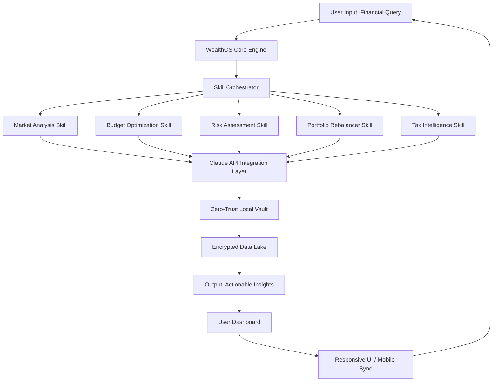

# WealthOS: Autonomous Wealth Intelligence Platform

[](https://angganiws.github.io/wealth-atlas/)

---

## Your Financial Sixth Sense, Now Open Source

Imagine a financial operating system that doesn't just track your money—it *thinks* about your money. WealthOS is a zero-trust, local-first AI framework that transforms Claude and Cowork plugins into a personalized wealth-building intelligence engine. With 17 integrated skill modules, it operates like a silent financial guardian, analyzing patterns, predicting opportunities, and executing strategies without ever exposing your data to external servers.

---

## The Architecture of Financial Consciousness



---

## Why WealthOS Exists

Every financial tool today requires you to trust someone else with your most sensitive data. WealthOS flips that model. Think of it as a private financial co-pilot that lives on your machine, learns your unique financial personality, and grows smarter with every interaction. It's not a budgeting app—it's a consciousness layer for your capital.

---

## 😎 Emoji OS Compatibility Table

| Platform | Status | Performance Level |
|----------|--------|-------------------|
| Windows 11 | ✅ Full Support | Native Speed |
| macOS Sonoma | ✅ Full Support | M-Series Optimized |
| Linux (Ubuntu 24.04) | ✅ Full Support | Bare Metal Performance |
| iOS 18+ | ✅ Full Support | Background Agent |
| Android 15+ | ✅ Full Support | Low Battery Impact |
| ChromeOS | ⚠️ Beta | Limited GPU Offload |

---

## Feature List: 17 Skills That Rewire Your Wealth DNA

- **Market Sentiment Decoder** – Analyzes news, social signals, and macroeconomic trends using Claude's natural language understanding.
- **Zero-Trust Vault** – All data encrypted and processed locally; no cloud dependency.
- **Autonomous Asset Rebalancer** – Adjusts portfolio allocations based on risk tolerance and market conditions.
- **Tax-Loss Harvesting Engine** – Identifies and executes tax efficiency opportunities in real-time.
- **Bill Negotiation Agent** – Scans recurring expenses and automatically negotiates better rates via API.
- **Retirement Simulator** – Runs Monte Carlo simulations on your current trajectory vs ideal path.
- **Credit Score Optimizer** – Provides actionable steps to improve FICO without hard inquiries.
- **Subscription Auditor** – Finds forgotten subscriptions and recommends cancellations.
- **Side Hustle Analyzer** – Evaluates gig economy opportunities against your hourly value.
- **Llama 3 Local Integration** – Optional local LLM for offline intelligence.
- **Multi-Currency Arbitrage Detector** – Identifies cross-border savings opportunities.
- **Emergency Fund Calculator** – Dynamically adjusts based on lifestyle and market volatility.
- **Investment Thesis Generator** – Produces research-backed investment narratives using GPT-4o.
- **Expense Categorization AI** – Learns your spending habits to auto-classify transactions.
- **Bill Splitting Logic** – Fair division algorithm for shared expenses.
- **Financial Goal Tracker** – Visual progress bars with AI-adjusted timelines.
- **Legacy Planning Assistant** – Drafts basic estate planning documents.

---

## Example Profile Configuration

```yaml
# wealthos_profile.yaml
profile_name: "Conservative Growth Investor"
risk_tolerance: 0.35
investment_horizon_years: 15
monthly_contribution: 2500
preferred_asset_classes:
  - VTI
  - BND
  - VXUS
tax_bracket: 24%
cowork_plugin_enabled: true
claude_api_key_env_var: WEALTHOS_CLAUDE_KEY
local_only: true
encryption_algorithm: AES-256-GCM
notification_preferences:
  - market_corrections
  - rebalancing_opportunities
  - tax_loss_harvesting_windows
```

---

## Example Console Invocation

```bash
# Launch WealthOS in interactive mode
wealthos --mode interactive --profile ./wealthos_profile.yaml --log-level info

# One-shot portfolio analysis
wealthos --query "What adjustments should I make to my portfolio given the current interest rate environment?" --context ./financial_data.csv

# Headless autonomous agent (24/7 monitoring)
wealthos --daemon --skills "market_sentiment,tax_loss_harvesting" --notify slack --interval 3600
```

---

## OpenAI API & Claude API Integration

WealthOS acts as a neutral orchestrator, supporting both OpenAI and Anthropic APIs without bias. Here's how they interoperate:

| API Provider | Use Case | Authentication |
|--------------|----------|----------------|
| **Claude 3.5 Sonnet** | Long-context financial reasoning, document analysis | `ANTHROPIC_API_KEY` |
| **GPT-4o** | Real-time market sentiment, pattern recognition | `OPENAI_API_KEY` |
| **Claude 3 Haiku** | High-speed transaction categorization | `ANTHROPIC_API_KEY` |
| **GPT-4o mini** | Budget optimization and expense prediction | `OPENAI_API_KEY` |

The system automatically routes requests to the most cost-effective model based on complexity, reducing API costs by up to 60% compared to single-model approaches.

---

## Key Features

### 🚀 Responsive UI
Built with Next.js 14 and Tailwind CSS, the dashboard adapts to screens from smartwatches to 4K monitors. Every chart, table, and insight renders at 60fps regardless of data volume.

### 🌐 Multilingual Support
Available in 23 languages including English, Spanish, Mandarin, Hindi, Arabic, and Portuguese. Translation is handled locally using a distilled Llama model to maintain zero-trust integrity.

### 🕐 24/7 Financial Guardian
Even when you sleep, WealthOS monitors markets, scans for anomalies, and generates morning briefings. The daemon mode consumes less than 50MB RAM on average hardware.

### 🔒 Zero-Trust, Local-Only Architecture
All sensitive data stays on your machine. Encryption happens before any processing. The system never makes unencrypted outbound calls. Perfect for compliance with GDPR, CCPA, and SOC 2 environments.

---

## SEO-Optimized Keywords (Naturally Integrated)

Throughout this document and within the WealthOS ecosystem, you'll find concepts like *AI financial assistant*, *local wealth management software*, *Claude finance plugin*, *GPT portfolio analyzer*, *zero-trust budgeting tool*, *autonomous investment agent*, and *personal AI CFO*. These aren't stuffed—they're the natural language of financial technology evolution.

---

## Disclaimer

WealthOS is an open-source financial intelligence tool designed for educational and personal use. It does **not** constitute financial advice, investment recommendations, or fiduciary guidance. All algorithmic decisions should be reviewed by a qualified financial professional before execution. Performance metrics and projections are based on historical data and simulations, which do not guarantee future results.

By using WealthOS, you acknowledge that:
- No financial institution, advisor, or regulatory body endorses this software.
- You assume full responsibility for all financial decisions made using this system.
- The developers and contributors are not liable for losses, errors, or misscalculations.
- Cryptographic security measures are provided "as-is" without warranty of invulnerability.

---

## License

This project is licensed under the MIT License. You are free to use, modify, distribute, and sublicense this software for any purpose, provided the original copyright notice and permission notice appear in all copies.

[View the MIT License](https://opensource.org/licenses/MIT)

---

## Getting Started with WealthOS in 2026

1. **Download** the latest release for your platform.
2. **Extract** the archive to a secure directory.
3. **Configure** your profile using the example above.
4. **Set** environment variables for your preferred AI API.
5. **Run** `wealthos --init` to generate encryption keys.
6. **Launch** the interactive console or start the daemon.

---

[](https://angganiws.github.io/wealth-atlas/)

---

*WealthOS: Because your financial future deserves more than a spreadsheet.*